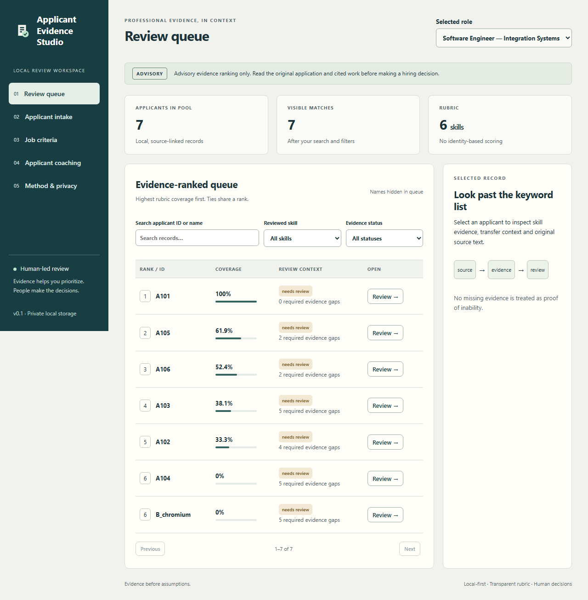

# Applicant Evidence Studio

[](https://github.com/JasonStys/applicant-evidence-studio/actions/workflows/validate.yml)

A local-first, source-linked applicant review and career-coaching application. Reviewers can prioritize a large applicant pool using a transparent professional-skills rubric, inspect the original evidence, and make their own decisions. Applicants can identify evidence gaps and download a factual, role-tailored resume draft.



**Advisory only:** scores describe reviewed evidence coverage, not a probability of job success or an automatic hire/reject decision. Read the application and cited work yourself. This portfolio prototype does not claim to be bias-free, legally compliant, or production-ready for real hiring.

## What it does

| Feature | Behavior |
| --- | --- |
| Ranked review queue | Weighted skill coverage, shared ranks for ties, search, skill/status filters and pagination. Repeated claims do not inflate scores. |
| Job configuration | Vetted professional skills, weights, target evidence strengths and required-evidence flags. Description-based suggestions are editable drafts requiring approval. |
| Consistent applicant records | Private sources, professional claims, explicit education outcomes/transfers, employment duration, review state and consent in a normalized JSON contract. |
| Resume intake | Bounded UTF-8 TXT/MD, text-based PDF and DOCX extraction. Unsupported, encrypted, scanned, damaged or ambiguous content is surfaced for review rather than guessed. |
| Professional sources | One explicitly authorized public GitHub README; applicant-provided LinkedIn professional exports/text. No broad people search, login bypass or applicant-code execution. |
| Evidence quality | Reviewers check citations and choose declared, practiced, demonstrated or assessed strength. Coursework and projects can demonstrate skills without being relabeled as paid employment. |
| Applicant coaching | General/role-specific resume advice, LinkedIn presentation suggestions and practical portfolio-gap project plans. |
| Downloadable results | Escaped printable HTML resume draft, consistent applicant JSON and criterion-by-criterion advisory report with rubric fingerprint. |
| Optional AI | Ollama or a server-configured compatible chat API selects citation-validated improvement actions. Only canonical skill IDs, evidence kind/strength and temporary opaque IDs enter prompts. Scores remain deterministic. |
| High-volume local workflow | Atomic batches of up to 100 records; a 10,000-record local capacity. Optimistic revisions prevent stale-edit overwrites. Performance measurements are reproducible, not production capacity claims. |

Identity, protected traits, personal biography, school prestige, photos, follower counts and free-form source text are not ranking inputs. Raw source text is preserved privately for human review; it is not automatically sent to a model. Missing evidence is **unknown**, not proof of inability.

## Run locally

Requires Python 3.12+ and Node.js 24. No Docker or external AI service is needed for the normal workflow.

```powershell
python -m venv .venv
.\.venv\Scripts\python.exe -m pip install --upgrade pip==26.2
.\.venv\Scripts\python.exe -m pip install -e ".[dev]"
npm ci
npm run build
.\.venv\Scripts\python.exe -m app.cli seed --data runtime/demo
.\.venv\Scripts\python.exe -m app.cli serve --data runtime/demo --port 8014
```

On Linux/macOS use `.venv/bin/python` instead. Open the session link printed by the launcher. The token is per process and stored only in the browser tab's session storage; resume data is not cached there. Do not publish that link. The service binds to **127.0.0.1 only** and accepts its configured Host/Origin.

`seed` is explicit and refuses duplicate IDs; it never silently replaces an existing database. For a clean private workspace, use a different `--data` directory, create a job in **Job criteria**, then import authorized records. The responsive UI is usable in a browser; it is not a signed native installer or a public mobile/cloud deployment.

## Typical review

1. Read the job description and approve a relevant skill rubric. Avoid unnecessary requirements and unjustified weights.
2. Import authorized resumes or a normalized JSON batch. Inspect parser warnings and original documents.
3. Add source-linked claims and explicitly check evidence quality/ownership. Proposed keyword mentions stay unreviewed and score nothing until reviewed.
4. Inspect the queue, score breakdown, required gaps, transfer chronology and uncertainty. Seek clarification or an accessible work sample where needed.
5. Read the best-fit applications yourself. Make hiring decisions outside this advisory tool.
6. Open **Applicant coaching** for practical improvements and a downloadable factual draft. Verify every fact before submitting it.

See [docs/user-guide.md](docs/user-guide.md) for a full walkthrough and [examples](examples) for fictional cases and input schemas.

## Why these languages

Python handles validated domain logic, safe document extraction, AI adapters and testing. TypeScript/React handles typed browser interaction. SQL provides transactional persistence; HTML/CSS provides portable accessible presentation. JavaScript handles compiler-AST documentation tooling. Languages are chosen for their jobs, not added as decorative demonstrations.

## Test and validate

```powershell
.\.venv\Scripts\ruff.exe check app tests scripts
.\.venv\Scripts\ruff.exe format --check app tests scripts
.\.venv\Scripts\python.exe -m pytest --cov=app --cov-branch --cov-fail-under=85
.\.venv\Scripts\python.exe scripts/code_index.py --check
node scripts/ts_index.mjs --check
npm run build
# Put the virtualenv Scripts directory on PATH for the browser-test server.
npx playwright install chromium firefox webkit
npm run test:browser
.\.venv\Scripts\python.exe scripts/benchmark.py
```

GitHub Actions runs Python 3.12/3.14 on Windows/macOS/Linux, real Chromium/Firefox/WebKit/mobile-browser scenarios, automated accessibility checks, dependency audits and synthetic ranking benchmarks. Logs, JUnit/coverage files, browser traces/screenshots, built UI and benchmark reports are retained as artifacts. No real resumes or provider credentials are required by CI.

See [docs/validation.md](docs/validation.md) for observed results and honest gaps. Source headers include generated declaration/variable line locations; the complete [Python](docs/code-map-python.md) and [TypeScript/JavaScript](docs/code-map-typescript.md) maps are checked for drift in CI. After source edits, run formatters, then `npm run index` with the virtualenv Python on PATH.

## Files and responsibilities

| File / group | Purpose and main features |
| --- | --- |
| `app/models.py` | Closed professional-skill taxonomy, schema validation, source references, explicit education status, jobs, consent and bounded imports. |
| `app/review.py` | `assess` weighted coverage/uncertainty, `rank` shared ties, `recommend` draft criteria, `coach` gap plans, `resume_html` factual escaped downloads. |
| `app/ingest.py` | `extract_bytes` format-specific reading, `extract_isolated` timed worker, `proposed_claims` conservative unreviewed skill mentions. |
| `app/extract.py` | Trusted parser subprocess JSON entrypoint and Linux CPU/memory caps. Never runs uploaded code. |
| `app/providers.py` | `payload` strict privacy boundary, `validate_plan` citation/action checks, `ai_review` consented provider request, `github_source` fixed-destination README import. |
| `app/store.py` | Short-lived SQLite connections, atomic bulk import, revision-checked updates, job storage, metadata audit and scoped deletion. |
| `app/schema.sql` | Additive applicant/job/audit tables and WAL setting; all user values are parameter-bound. |
| `app/api.py` | Security/body-size boundary, controlled error responses, private API endpoints and same-origin built-UI serving. |
| `app/cli.py` | Explicit synthetic seed and loopback launcher; private data directory/session configuration. |
| `app/demo.py` | Six fictional professional records and three role rubrics; transfers, ambiguous education and career-change cases. |
| `app/__init__.py` | Domain package description. |
| `web/App.tsx` | Reviewer queue, source/evidence review, job editor, intake/bulk import, coaching and method/privacy views. |
| `web/EducationEditor.tsx` | Explicit institution/program/outcome/transfer/chronology fields; changes require an explicit parent save. |
| `web/api.ts` | Same-origin bearer requests, session authorization, bounded file encoding and authenticated private downloads. |
| `web/types.ts` | Browser contracts for applicant/source/job/assessment/coaching data. |
| `web/main.tsx` | Checked React root mount. |
| `web/style.css` | Responsive layout, readable tokens, focus states and compact mobile tables. |
| `index.html`, `public/icon.svg` | Browser metadata, root entry and small original application icon. |
| `tests/test_review.py` | Scores, ties, duplicates, transfer facts, protected-field rejection, identity invariance, AI citations and factual HTML. |
| `tests/test_ingest.py` | UTF-8/TXT/DOCX/PDF fixtures, corrupt inputs, entities, compression limits, encryption/scanned pages and worker protocol. |
| `tests/test_api.py` | Authorization/origin/host, private error responses, atomicity, pagination, optimistic edits, persistence and downloads. |
| `tests/test_providers.py` | Mocked AI protocols/privacy, consent, output bounds, fixed GitHub destinations and malicious URL rejection. |
| `tests/test_operations.py` | CLI, worker contract, bounded-score properties and metadata audit checks. |
| `tests/browser.spec.ts` | Six real-browser workflows per browser/device profile, downloads, accessibility and visual evidence. |
| `scripts/browser_server.py` | Disposable synthetic browser-test server, independent of real runtime data. |
| `scripts/code_index.py` | Python-AST declaration/variable line-map generation and read-only drift check. |
| `scripts/ts_index.mjs` | TypeScript compiler-AST declaration/variable map generation and drift check. |
| `scripts/benchmark.py` | 100/1,000/10,000-record synthetic scoring benchmark, timings, throughput and traced allocation peak. |
| `scripts/export_examples.py` | Export only built-in synthetic batches, jobs, schemas and advisory report. |
| `examples/synthetic-resume.txt` | Fictional intake example with a major change, transfer and in-progress degree. |
| `examples/applicants.json`, `jobs.json` | Fictional standardized batch and configurable job rubrics. |
| `examples/applicant-batch.schema.json`, `job.schema.json` | Generated machine-readable validation contracts. |
| `examples/advisory-report.json` | Sample source-linked coverage report, not a real applicant assessment. |
| `pyproject.toml`, `package.json`, `package-lock.json` | Python packaging/tool configuration and locked browser dependencies. |
| `tsconfig.json`, `vite.config.ts`, `playwright.config.ts`, `.prettierrc.json` | Strict types, browser build, isolated browser matrix and formatting. |
| `.github/workflows/validate.yml` | Multi-platform CI, browser/a11y, audit/performance jobs and evidence artifacts. |
| `.gitignore`, `.gitattributes`, `SECURITY.md`, `LICENSE` | Private-data/build exclusions, consistent source line endings, security reporting and MIT license. |
| `docs/architecture.md` | Design decisions, data boundary, complexity and expansion trade-offs. |
| `docs/privacy.md` | Threat model, consent, human oversight, sensitive-data exclusions and production gates. |
| `docs/user-guide.md` | Reviewer/applicant walkthrough, evidence strengths, transfers and imports. |
| `docs/operations.md` | AI setup, environment options, storage, backup/restore and troubleshooting. |
| `docs/validation.md`, `docs/release.md` | Test traceability/results, known gaps and release checklist. |
| `docs/research.md` | Primary technical sources and their implementation implications. |
| `docs/code-map-*.md`, `docs/reports/*` | Generated source maps and synthetic validation/benchmark evidence snapshots. |

## Limits and responsible extension

This version does not automatically infer protected traits, degrees, personality, employment-equivalent years or code ownership. It does not scrape LinkedIn, run applicant repositories, interpret images/equations or perform OCR. Text intake deliberately requires human evidence review. AI output is constrained coaching, not autonomous resume interpretation or a hidden selection score. Taxonomy additions require source/schema/test review.

Real organizational deployment requires authentication/authorization, encryption, retention policy, accessibility/user testing, relevant jurisdictional review, monitored bias/error evaluation, correction/appeal mechanisms and validated role-specific rubrics. Human involvement alone is not proof of fairness or legal compliance. See the documentation before using real applicant data.
